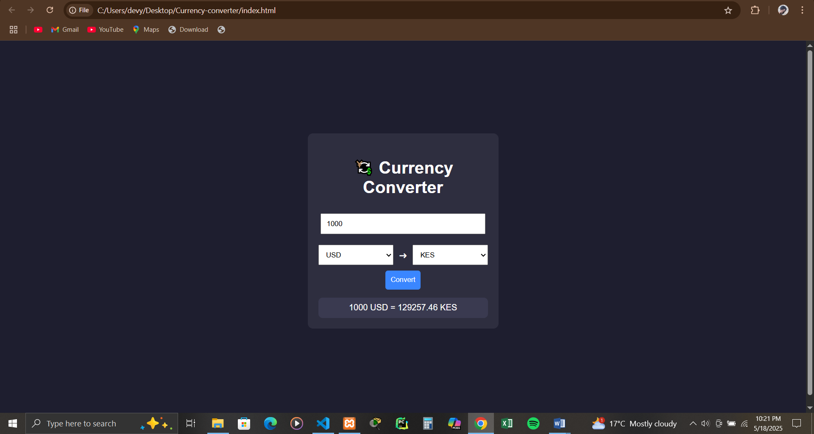

# 💱 Currency Converter

A simple web-based currency converter that allows you to convert between currencies using real-time exchange rates.

## 🌐 Features

- 🔁 Convert between 10+ major currencies
- 🧮 Simple, clean UI with instant calculation
- 🔧 Powered by [ExchangeRate API](https://www.exchangerate-api.com)
- ⚙️ Easy to use and responsive

## 📸 Screenshot



## 🚀 Getting Started

1. Clone the repo:
   ```bash
   git clone https://github.com/your-username/currency-converter.git
currency-converter/
│
├── index.html         # Main HTML file
├── style.css          # Styling
├── script.js          # JavaScript logic
├── currency-converter.png  # Screenshot
└── README.md

---

### ✅ Step 3: Stage and commit the README

In your terminal:

```bash
git add README.md
git commit -m "Add README with project description and screenshot"
git push
